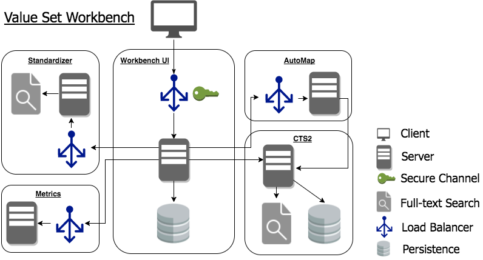

|Name | Description|
|----- | ------|
| [Value Set Workbench UI](https://github.com/valuesetworkbench/valueset-workbench) | A value set management tool focused on usability, simplicity, and interoperability. |
| [Docker Install](https://github.com/valuesetworkbench/valueset-workbench-docker) | A Docker Compose-based system for deploying the suite to tools comprising the Value Set Workbench. |
| [AutoMap](https://github.com/valuesetworkbench/valueset-automap) | An automated value set -> value set mapping tool based on lexical similarity. |
| [Standardizer](https://github.com/valuesetworkbench/valueset-standardizer) | An automated translation service to transform local value sets -> UMLS. |
| [ArangoDB CTS2 Service](https://github.com/valuesetworkbench/arangodb-service) | A CTS2-compliant terminology service based on the ArangoDB graph database. |